<div align="center">

<picture>
  <source media="(prefers-color-scheme: dark)" srcset="assets/logo-dark.png">
  
</picture>

# SkillZip

**Evaluation-Free Skill Compression for Self-Evolving Agents<br/>by Discovering Reusable Structure**

<p>
  <a href="https://arxiv.org/pdf/2608.11079"></a>
  <a href="LICENSE"></a>
  
  
  
</p>


📄 **Paper:** [arXiv:2608.11079](https://arxiv.org/pdf/2608.11079)

</div>


## Overview

Self-evolving agents keep appending what they learn to a **skill** — a markdown
document that serves as the agent's trainable state. Over many evolution rounds
this document inflates: rules get restated, workflows get duplicated, and the
prompt budget silently erodes.

**SkillZip** compresses such a skill by **discovering the reusable structure**
inside it. Its guiding intuition is *explain once, reference many*: state a
repeated rule once at the scope where it applies, factor a repeated action
sequence into a shared procedure, and keep only the differences as explicit
exceptions. This is formalized as a typed minimum-description-length objective
over a skill contract plus a residual, subject to a hard coverage constraint for
every extracted trigger, workflow edge, tool requirement, obligation, and output
field.

Two properties make it practical:

- 🔒 **Evaluation-free.** Compression reads *only* the skill text — never tasks,
  rewards, trajectories, or verifiers. No benchmark run is needed to compress,
  so it cannot overfit to an evaluation set.
- 🛡️ **Never inflates.** The all-verbatim representation is always a candidate.
  If the structured rendering is not strictly shorter, the original is kept
  as-is. The conservative failure mode is *under*-compression, never corruption.

A compressed skill is still an ordinary markdown file — a drop-in replacement
for the original.

## Key features

| | Feature | Description |
| :-- | :-- | :-- |
| 🧩 | **Typed contract extraction** | Recovers interface / workflow / tool / rule / output / evidence units with provenance back to source blocks. |
| 📐 | **MDL-style selection** | Picks the minimum-cost covering explanation under an explicit length model. |
| 🔁 | **Zip-on-Write** | Continual compression: integrate each accepted evolution patch incrementally, with periodic repacking. |
| 🔍 | **Structural audit** | Re-parses the compressed text and conservatively restores anything that went missing. |
| 🔗 | **Reference integrity** | Keeps intra-document anchors (“jump to Step 8”, “see §9.1”) and their targets consistent. |
| ⚙️ | **Deterministic core** | Selection and rendering are fully deterministic; the same input yields the same output. |
| 📦 | **Zero dependencies** | The deterministic path runs on the Python standard library alone. |

## How it works

```mermaid
flowchart LR
    S["SKILL.md"] --> SC[scanner]
    SC --> EX[extract]
    EX --> RE[relations]
    RE --> WF[workflow]
    WF --> OP[optimize]
    OP --> CA[canon]
    CA --> RN[render]
    RN --> AU[audit]
    AU --> O["SKILL.compact.md"]

    classDef det fill:#E8F4EA,stroke:#4C9A60,color:#1E3D28
    classDef mdl fill:#FFF3E0,stroke:#E8873A,color:#5A3312
    class SC,WF,OP,CA,RN det
    class EX,RE,AU mdl
```



<sub>🟩 deterministic &nbsp;&nbsp; 🟧 model-assisted (with deterministic fallback)</sub>

| Stage | Module | Deterministic? | Role |
| :--- | :--- | :---: | :--- |
| Scan | `scanner.py` | ✅ | Split markdown into blocks with stable provenance ids. |
| Extract | `extract.py` | ⚙️ | Recover the typed contract under a JSON schema (falls back to a deterministic parser). |
| Relate | `relations.py` | ⚙️ | Type-compatible retrieval + equivalence/implication/conflict checks behind hard blocking keys. |
| Mine | `workflow.py` | ✅ | Build the workflow graph and mine repeated sequences (Re-Pair). |
| Select | `optimize.py` | ✅ | Minimum-cost covering selection under the length model in `cost.py`. |
| Canonicalize | `canon.py` | ✅ | Per-unit minimal faithful phrasing, verified to be strictly shorter and literal-safe. |
| Render | `render.py` | ✅ | Fixed-template rendering into the compact skill. |
| Audit | `audit.py` | ⚙️ | Diff the compressed text against the source contract; restore anything dropped. |

> Model assistance is optional. Without an API key (or with `--no-llm`) every
> stage uses its deterministic path and the pipeline runs fully offline.

## Quick start

No installation and no third-party packages are required for the deterministic path.

```bash
git clone <repository-url> && cd skillzip
python compress_demo.py                        # compress examples/sample_skill.md. You can paste your skill here
python compress_demo.py path/to/SKILL.md       # compress your own skill
python compress_demo.py path/to/SKILL.md out.md  # write the result to a file
```

Example output:

```text
============================================================
skill               : sample_skill
original tokens     : 6,524
compressed tokens   : 4,389
remaining ratio     : 0.6727  (1.0 = unchanged, lower = more compression)
extracted units     : 16
library units       : 16  procedures=0  residual=0
verbatim fallback   : False
============================================================
```

## Python API

```python
from skillzip import compress_oneshot, zip_on_write
from skillzip.skill import Skill

# ---- Algorithm 1: one-shot compression -------------------------------------
skill = Skill.load("SKILL.md", "my_skill")
compressed, report = compress_oneshot(skill, cli=None)   # cli=None -> deterministic
print(report["remaining_ratio"])                          # e.g. 0.62
compressed.save("SKILL.compact.md")

# ---- Algorithm 2: continual compression (Zip-on-Write) ---------------------
compressed, report, state = zip_on_write(
    initial_text=open("SKILL.seed.md").read(),
    patches=[open(p).read() for p in patch_files],        # accepted evolution patches
    name="my_skill",
)
state.save("skillzip.json")                               # resumable compression state
```

To enable the model-assisted stages, pass any OpenAI-compatible client:

```python
from skillzip.llm import LLMClient
import os

cli = LLMClient(model="<your-model>", backend="real",
                base_url="<your-openai-compatible-endpoint>",
                api_key=os.environ["DASHSCOPE_API_KEY"])
compressed, report = compress_oneshot(skill, cli=cli)
```

## Command-line interface

```bash
pip install -r requirements.txt        # only needed for the model-assisted stages
export DASHSCOPE_API_KEY=...           # supply credentials via the environment

# one-shot compression (also persists the reusable library)
python -m skillzip.cli compress SKILL.md --output SKILL.compact.md --state skillzip.json

# continual compression: integrate one accepted evolution patch
python -m skillzip.cli update skillzip.json PATCH.md --output SKILL.md

# verify a compressed skill still covers the source contract
python -m skillzip.cli audit SKILL.compact.md skillzip.json

# inspect the library and the per-operation saving log
python -m skillzip.cli inspect skillzip.json --show-savings
```

Add `--no-llm` to any command to force the deterministic-only path.
State files are written through a temporary file and replaced only after schema,
coverage, and rendering checks pass.

## Configuration

`DEFAULT_CFG` in [`skillzip/api.py`](skillzip/api.py) holds the knobs; presets live
in [`skillzip/configs/`](skillzip/configs). Override per call via
`compress_oneshot(skill, cfg={...})`.

| Key | Default | Meaning |
| :--- | :---: | :--- |
| `extract_llm` | `True` | Use the schema-constrained model for contract extraction. |
| `audit_llm` | `True` | Re-parse with the model during the structural audit. |
| `audit` | `True` | Run the structural audit and conservative recovery. |
| `top_k` | `6` | Relation-retrieval breadth per unit. |
| `min_sim` | `0.12` | Lexical pre-filter; low on purpose so the relation checker decides. |
| `min_conf` | `0.55` | Minimum relation confidence required to act. |
| `canonicalize` | `True` | Enable per-unit minimal faithful phrasing. |
| `wf_min_len` / `wf_min_occ` | `2` / `2` | Minimum length / occurrences for a mined workflow fragment. |
| `repack_every` | `4` | Zip-on-Write: repack after this many patches. |
| `repack_growth` | `0.5` | Zip-on-Write: repack when the contract grows beyond this ratio. |

## Project structure

```text
.
├── skillzip/                    # the SkillZip package
│   ├── __init__.py              # public API surface
│   ├── api.py                   # compress_oneshot (Alg. 1), zip_on_write (Alg. 2)
│   ├── contract.py              # typed contract data model + state (de)serialization
│   ├── scanner.py               # markdown blocking with stable provenance
│   ├── extract.py               # schema-constrained contract recovery
│   ├── relations.py             # typed retrieval + relation checks
│   ├── workflow.py              # workflow graph + repeated-sequence mining
│   ├── optimize.py              # minimum-cost covering selection
│   ├── cost.py                  # length / cost model
│   ├── canon.py                 # minimal faithful canonicalization
│   ├── render.py                # deterministic template rendering
│   ├── audit.py                 # contract diff + conservative recovery
│   ├── online.py                # Zip-on-Write + write-ahead log
│   ├── refs.py                  # intra-document reference integrity
│   ├── prompts.py               # templates for the model-assisted stages
│   ├── skill.py                 # the Skill artifact
│   ├── llm.py                   # OpenAI-compatible client (only model dependency)
│   ├── cli.py                   # command-line interface
│   ├── configs/                 # configuration presets
│   ├── prompts/                 # prompt templates as plain text (auditable)
│   └── schemas/                 # JSON schema for the typed contract
├── assets/                      # brand artwork (logo, wordmark, affiliations)
├── compress_demo.py             # zero-dependency entry point
├── requirements.txt
└── LICENSE
```


## Requirements

- Python **3.8+**
- Core (deterministic) path: **standard library only**
- Model-assisted stages: `requests` (see [`requirements.txt`](requirements.txt))

## Citation

If you find this work useful, please cite our paper:

> **SkillZip: Evaluation-Free Skill Compression for Self-Evolving Agents by
> Discovering Reusable Structure.** [arXiv:2608.11079](https://arxiv.org/pdf/2608.11079)

```bibtex
@article{skillzip2026,
  title         = {SkillZip: Evaluation-Free Skill Compression for Self-Evolving
                   Agents by Discovering Reusable Structure},
  author        = {Bai, Xiaofan and Lin, Hongqiang and Liu, Chao and
                   Zhang, Yantao and Jin, Xuan and Cao, Xipeng and Li, Yuhong},
  journal       = {arXiv preprint arXiv:2608.11079},
  year          = {2026},
  eprint        = {2608.11079},
  archivePrefix = {arXiv},
  primaryClass  = {cs.AI},
  doi           = {10.48550/arXiv.2608.11079},
  url           = {https://arxiv.org/abs/2608.11079}
}
```


## License

Released under the [Apache License 2.0](LICENSE).

```text
Copyright 2026 Alibaba Group
```

## Contact

For questions about the method or this implementation, please open an issue or
contact the corresponding authors listed above.
